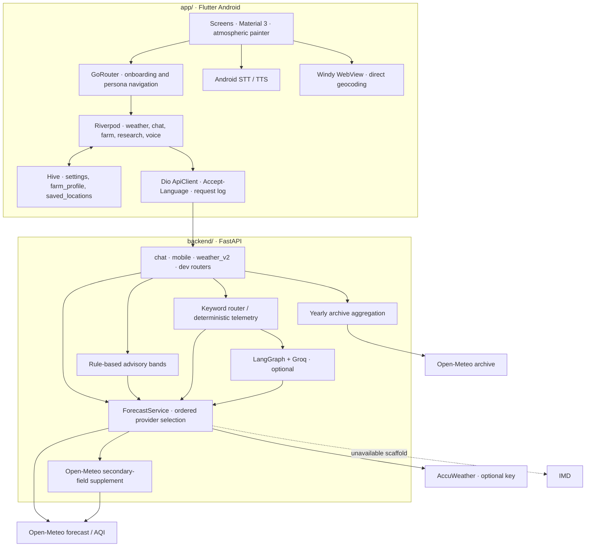
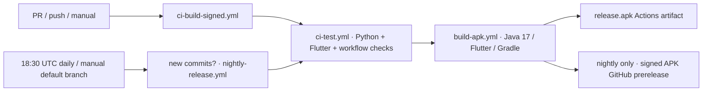

# WeatherGPT Android — architecture

_Last audited: 2026-09-26. This describes the checked-in code, not a certification
of a live deployment._

Adapted from [weathergpt-app's architecture at `9ad3c51`](https://github.com/omsenjalia/weathergpt-app/blob/9ad3c5178c52e53006d528748ea7359bd558f393/ARCHITECTURE.md).
The Android-only layout, reduced provider set and threshold-only advisories are
intentional differences. See [the comparison and verification report](docs/REPOSITORY_COMPARISON.md).

## 1. Scope and capability boundaries

WeatherGPT is a Flutter Android client and a Python FastAPI backend in **one Git
repository**. It provides weather, chat/voice, farm action windows and yearly
historical charts. A persona changes presentation and request context; it is not
an authorization role.

| Capability | What this repository implements |
|---|---|
| Android client | Everyone, Farmer and Researcher personas; Material 3 UI |
| Weather | Open-Meteo keyless baseline; optional AccuWeather current/daily adapter; source provenance |
| IMD | Adapter scaffold only. Credentials do **not** enable a working forecast or official-alert feed |
| Chat | Keyword intent routing; deterministic telemetry; optional Groq/LangGraph tool-calling agent |
| Farm advisory | Server-side weather thresholds and hourly activity bands, **not** Jev/TypeSafe decisions |
| Research | Yearly Open-Meteo archive series, returned-window deviations, saved-location comparison |
| Voice and translation | Nine translation catalogs; device STT/TTS, subject to installed engines/language support |
| Backgrounds | Animated custom-painted skies and gradients; **no MP4/video_player dependency** |
| Diagnostics | Request log, provider/source inspection, configuration health and developer settings |

Not implemented here: iOS runner/builds; WeatherNext/BigQuery/GCS/Earth Engine;
System One/decision APIs; ensemble/profile/model-run/inference APIs; live official
IMD alerts; push notifications; radar ingestion; LoRaWAN. Windy is an external
map embed, not an in-house radar feed. Some legacy models/utilities can parse
richer sibling-backend payloads; their existence does not enable those services.

## 2. System topology



The client also contacts Open-Meteo geocoding and BigDataCloud reverse-geocoding
directly (`geocoding_service.dart`). Windy content loads in its own WebView.
Weather/provider/LLM keys must never be shipped to these client surfaces.

## 3. Repository and stack

```text
.github/workflows/        Tests, APK builds, nightly release orchestration
scripts/                 Validated CI config/signing preparation and unit tests
app/
  android/               Native runner, manifest, Gradle and signing
  assets/translations/   bn en gu hi kn ml mr ta te JSON catalogs
  lib/core/              API, request context, localization, theme, shared widgets
  lib/features/          home/chat/explore/farmer/researcher/onboarding/settings/voice
  lib/models/            Weather/location parsers and nullable data models
  lib/router/            GoRouter route graph
  test/                  Unit/widget tests and shared backend response fixture
  docs/                  Android contracts and historical research notes
backend/
  main.py                App factory, CORS, request IDs/logging, router registration
  api/index.py           Vercel entrypoint (same FastAPI app)
  schemas.py             Validated chat request/response contracts
  routers/               HTTP adapters
  services/providers/    IMD scaffold, AccuWeather, Open-Meteo adapters
  services/              Selection, supplementation, advisory, chat, legacy fusion
  agent.py, tools.py     LangGraph graph, tool registry, deterministic reply builder
  tests/                 Offline route/service/contract regressions
```

- **Toolchain:** CI pins Flutter **3.44.0** (Dart **3.12+**), Java **17**, Python
  **3.11**. Android settings currently specify AGP **9.0.1**, Kotlin **2.3.20** and
  Gradle **9.1.0**, aligned to the Flutter 3.44.0 template. Flutter applies the
  Kotlin plugin through its compatibility layer while built-in Kotlin is disabled. Android compilation remains a required CI/device verification step.
- **Client:** Riverpod 2, GoRouter 14, Dio 5, Hive, easy_localization, fl_chart,
  gpt_markdown, speech_to_text, flutter_tts, webview_flutter, geolocator.
- **Backend:** FastAPI 0.115.0, Uvicorn 0.30.6, LangGraph 0.2.28,
  langchain-groq 0.2.0, langchain-core 0.3.0, httpx 0.27.2, Pydantic.
- `pubspec.yaml` declares constraints and `pubspec.lock` records a prior solve.
  The inherited lock contains speech_to_text 6.6.2 despite the manifest's ^7.4.0;
  `flutter pub get` must resolve this before analysis/build. Do not describe that
  lock as a freshly verified reproducible dependency set; see validation report.

## 4. Configuration and trust boundary

### Client

`resolveBackendUrl` resolves **`--dart-define=BACKEND_URL` → `app/.env` → emulator
`http://10.0.2.2:8888`**. No implicit connection to the sibling app's production
host. A real phone needs a reachable LAN address or a deployed HTTPS backend.

`app/.env` is a Flutter **asset**, readable from the APK. It may contain only a
public backend URL. Never put Groq/provider keys, passwords or OAuth credentials
there. Android permits cleartext traffic for local development; use HTTPS for
releases and consider a release-only network-security restriction before public
production distribution.

### Backend

`load_dotenv()` reads local environment configuration. Start from `backend/`.

| Setting | Effect |
|---|---|
| `GROQ_API_KEY` | Optional; blank/placeholder disables the LLM path |
| `GROQ_MODEL` | Primary Groq model; default `openai/gpt-oss-120b` |
| `WEATHER_PROVIDER_PRIORITY` | Ordered concrete provider IDs; default `imd,accuweather,open_meteo` |
| `ACCUWEATHER_KEY` | Enables attempts to the AccuWeather adapter; subscription limits still apply |
| `IMD_API_KEY`, `IMD_JWT_TOKEN` | Reserved scaffold configuration, not proof of an implemented feed |
| `WEATHERAPI_KEY`, `TOMORROW_KEY`, `OPENWEATHER_KEY` | Optional providers for legacy `/fusion` diagnostics, not the primary forecast chain |
| `WEATHER_SUPPLEMENT_ENABLED` | Secondary-field enrichment switch (default on) |
| `CHAT_FAST_PATH`, `CHAT_TIMEOUT_SECONDS` | Deterministic fast path and reasoning timeout |

There is no Google/WeatherNext/TypeSafe configuration requirement. The root ignore
rules exclude `.env`, virtual environments and signing material. Examples are
tracked. Java keystore secrets belong to GitHub Actions or local environment
variables, not the app bundle or repository.

## 5. Client lifecycle, state and navigation

1. Initialize Flutter bindings/localization, load `.env`, open Hive boxes.
2. Restore saved language; synchronize Dio's `Accept-Language` header.
3. Mount `ProviderScope` and `MaterialApp.router`.
4. GoRouter redirects a new user through splash/language/persona onboarding.
   Farmer onboarding additionally offers a form or a scripted local STT/TTS
   conversation; both save the same farm profile.
5. Shell routes provide home, chat, explore, persona hub and profile. Separate
   routes provide saved locations, action windows, historical/trend/comparison
   screens, debug state and voice selection/results.

Weather observes location, persona and developer options. Chat and voice share
`AgentRequestContext` and attach farm details only for Farmer requests. Settings,
farm profile and saved places persist in Hive; they are not encrypted secret
stores. Chat state is in memory. The advisory client caches by location/profile
and day, invalidating stale context; failure is explicit rather than an invented
safe-action forecast.

## 6. Weather lifecycle and source semantics

1. `buildWeatherQuery` sends lat/lon, mode, `requested_source`, daily/hourly bounds
   and the optional supplement switch. **All personas default to `auto`.**
2. `/v2/weather` delegates to the same service as `/weather`, explicitly passing
   every argument rather than leaking FastAPI `Query` objects into Python calls.
3. `ForecastService` tries configured/eligible providers in order. An explicit
   source pin tries only that provider. Unknown/removed source names are rejected.
4. Open-Meteo normalizes local hourly timestamps to UTC, retains civil timezone
   metadata and nullable values, and carries current/hourly/daily/AQI data.
5. AccuWeather supplies current/daily data; its adapter does **not** fetch its
   hourly endpoint. Secondary supplementation fills select missing fields, not
   a missing primary hourly series or fabricated measurements.
6. The response contains flat current fields, `hourly`, `forecast`, `location`,
   `selected_source`, `requested_source`, provenance and field attribution. This
   Android v2 facade is **not** the sibling's full WeatherNext v2 API.
7. Flutter's v2 parser understands this flat shape. An automatic-source v2 error
   may retry `/weather`; pinned requests never silently substitute a legacy call.

Default display horizons are **48 hours / 7 days**, capped by actual provider
coverage. The API accepts 1–168 hourly rows and 1–16 daily rows; UI developer
settings currently offer 6–168 hours and 1–15 days. The returned rows can be fewer.
Total provider failure returns HTTP **502** with an unavailable detail, not a
synthetic sunny/zero-rain snapshot. WMO `0` is clear sky, not missing data.

`forecast_supplement.py` has an in-process 15-minute geographic-cell cache. The
separate forecast-cache utility exists for legacy diagnostics but is not wired
as a cache around the current selector. Neither is a shared database or durable
serverless cache.

## 7. HTTP contract inventory

See [Android data contracts](app/docs/app_data_contracts.md) and
[endpoint inventory](app/docs/web_app_api_contract.md) for wire details.

| Endpoint | Consumer / purpose |
|---|---|
| `GET /` | Service index and supported client/policy description |
| `GET /health` | Process liveness; no upstream-availability guarantee |
| `GET /weather`, `GET /v2/weather` | Home weather/provider selection |
| `GET /v2/weather/health` | Debug configuration/eligibility, not a live provider probe |
| `POST /chat` | Chat and voice share `{response, meta}` |
| `GET /advisory` | Crop-labeled weather thresholds; days 1–7; first two days have hourly bands |
| `GET /historical` | Yearly archive aggregation (rainfall/temperature/humidity) |
| `GET /comparison` | Named-location yearly series; geocoded names may contain commas |
| `GET /fusion` | Legacy weighted current-weather diagnostics |
| `GET /dev`, `GET /dev/forecast` | Diagnostics / source checks |
| `POST /dev/sandbox` | Agent diagnostics; potentially billable if Groq enabled |

There is no `/voice` backend endpoint: STT produces text for `/chat`, and TTS reads
its answer. No `/v2/weather/catalog` or `/v2/weather/series` route is advertised.

## 8. Chat, language and widgets

`services/chat.py` resolves history, normalizes language/client/mode/source and
classifies intent with keywords. Greetings and off-topic boundaries are local
replies. Simple weather questions use deterministic telemetry. Complex questions
can use the Groq-backed LangGraph loop; missing credentials, failures or timeouts
fall back to telemetry. A timeout stops waiting, **not** an already-running HTTP
request/thread; provider timeouts still bound downstream work.

The same tool registry is used to bind Groq tools and execute LangGraph tool
calls. Available tools cover geocoding, current/daily/hourly weather, AQI, UV/sun,
wind/pressure, agricultural telemetry and weather-derived hazard guidance. They
are not WeatherNext or external decision-platform tools. Explicit chat source
pins use the constrained deterministic path rather than unconstrained LLM tools.

`response.py` strips reasoning markup and sanitizes structured widget fences;
Flutter renders supported cards and normal Markdown. Voice additionally removes
markup unsuitable for speech. Nine UI catalogs are shipped (bn/en/gu/hi/kn/ml/mr/
ta/te); runtime STT/TTS depends on the device. Some deterministic server replies
and developer labels remain English, so nine catalogs do **not** imply fully
localized offline advice in every path.

## 9. Advisory, research and safety limits

- Farm windows derive from rain, wind, temperature and available hourly evidence.
  Missing daily critical inputs produce a neutral/unavailable verdict, not a
  positive recommendation. Heat never overrides a worse rain-risk band.
- `ai.enabled`/`ai.applied` are false; the engine is `thresholds`. Crop labels are
  accepted, but the threshold engine is not a crop/soil/stage-calibrated agronomy
  model. Stored profile details reach LLM context when enabled; no System One
  confidence badge should be inferred from a rules-only response.
- Historical endpoints aggregate returned archive records. Monthly climatology,
  official climate-normal anomalies, ensemble spread and pressure profiles are
  unsupported. The current defaults end in 2024; they are not "latest through
  today". Archive completeness is not audited against a climate-grade standard.
- Official IMD warnings are unimplemented; an unknown alert status means
  **unknown**, never "no danger". Weather-derived suggestions are not certified
  emergency bulletins, pesticide instructions or guaranteed safe work windows.

## 10. Deployment, CI and signing

The backend can run under Uvicorn or Vercel with project root **`backend/`**.
`api/index.py` imports the same app; `vercel.json` rewrites requests to that
entrypoint. No workflow auto-deploys the backend. Configure the hosted backend
separately, then set the public APK `BACKEND_URL` to that deployment.



- Shell logging uses `pipefail`; failed analysis/tests cannot be hidden by `tee`.
- Backend tests use fake upstream readings and blocked network sockets. No live
  provider keys required for validation. Analysis/tests gate both APK paths.
- CI builds without secrets use clearly labeled **debug signing** and an
  emulator-only URL. These APKs are development artifacts, not production-ready
  packages. PR code never receives release-keystore credentials.
- Nightly publication requires a deployed HTTPS URL and **all four** signing
  secrets: `KEYSTORE_BASE64`, `KEYSTORE_PASSWORD`, `KEY_ALIAS`, `KEY_PASSWORD`.
  Partial credentials fail; signed mode never silently downgrades to debug keys.
- CI writes an **absolute** `KEYSTORE_PATH`, avoiding Gradle module-relative path
  mistakes. Transient keystore files and `.env` are removed after builds.
- CI and nightly version codes share a seconds-since-2020 scheme (no independent
  workflow run-number collisions). Nightly tags use UTC `nightly-YYYYMMDD`, target
  the tested commit and are prereleases. An existing date/tag is not overwritten.
- Actions wraps artifacts in ZIP downloads; the GitHub Release asset is the
  direct `release.apk`. Debug keys from different runners are not a stable
  upgrade identity; nightly uses the stable release key.

There is no backend submodule or two-repository push ceremony. Use ordinary Git
from the repository root. The inherited `app/scripts/push-all.sh` now prints safe
monorepo guidance and does not auto-commit or push unrelated files.

## 11. Verification and operational limits

Executable checks and outstanding device/deployment checks are recorded in
[the audit report](docs/REPOSITORY_COMPARISON.md#verification).

Before public production exposure, add authentication/access control for
billable diagnostics, rate limiting, request/resource limits, dependency/security
updates and a deployment-specific CORS policy. Current CORS is wildcard without
credentials, and developer endpoints are not authenticated. Logs/settings can
contain locations and user text. Hiding the debug UI is not server-side access
control. This architecture does not assert production hardening or live-service
availability merely because local tests pass.
