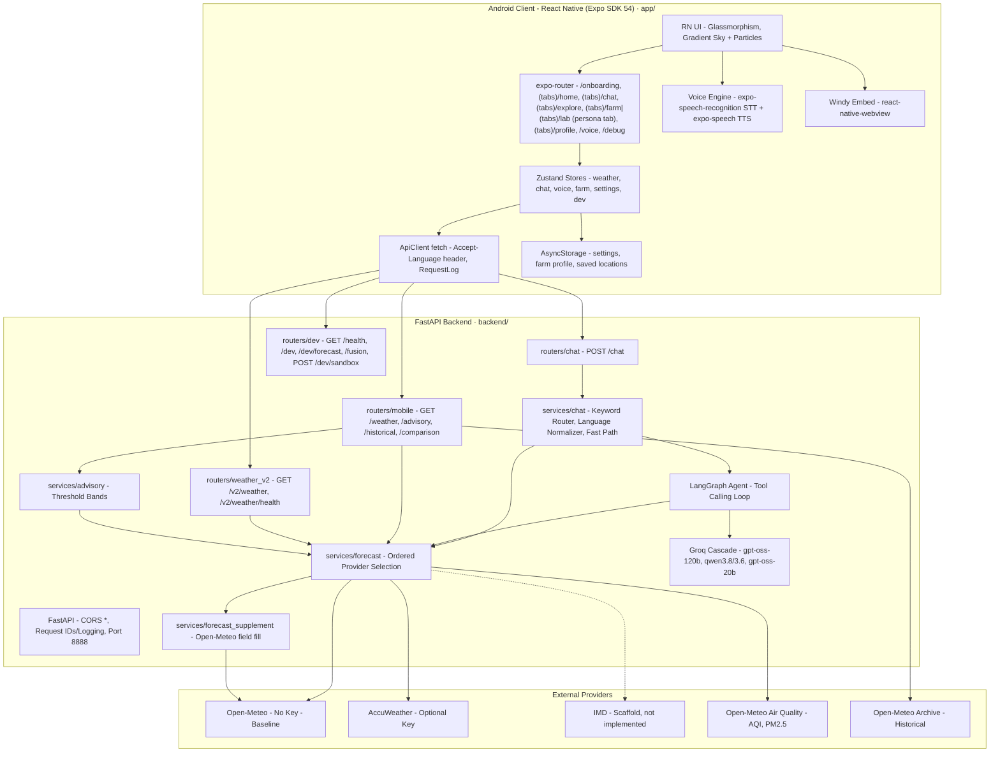
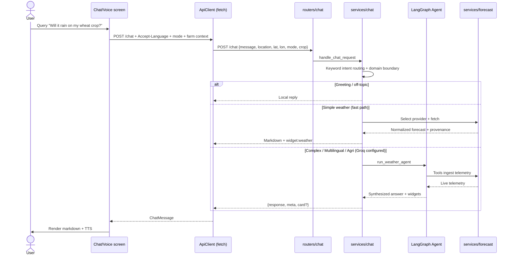
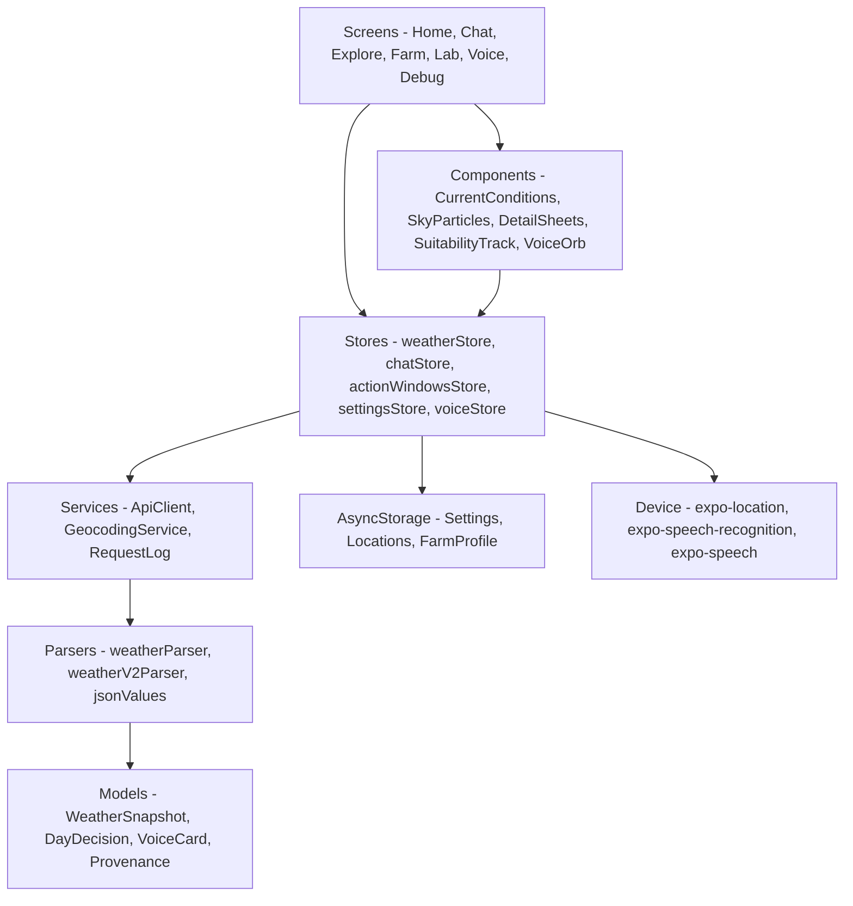
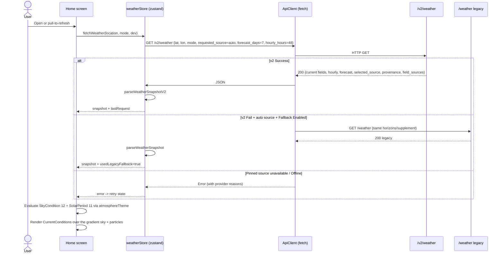
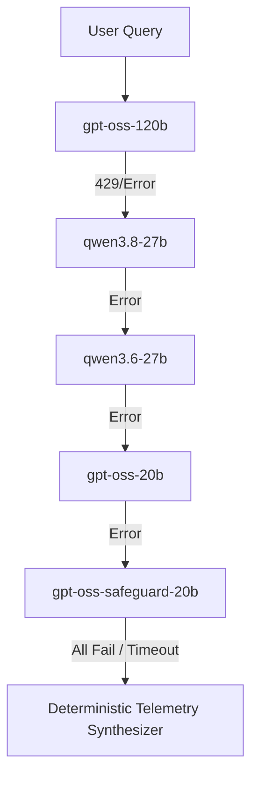
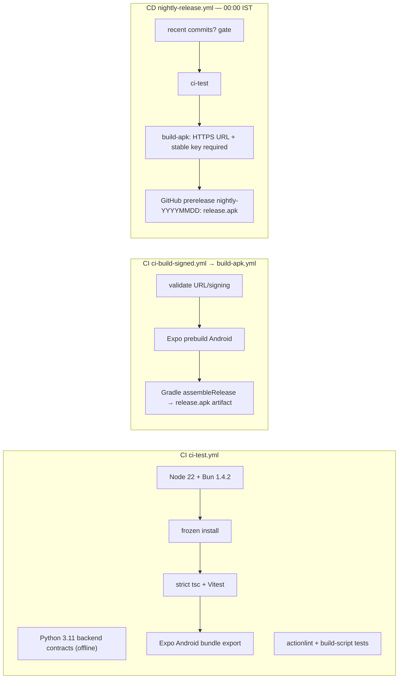
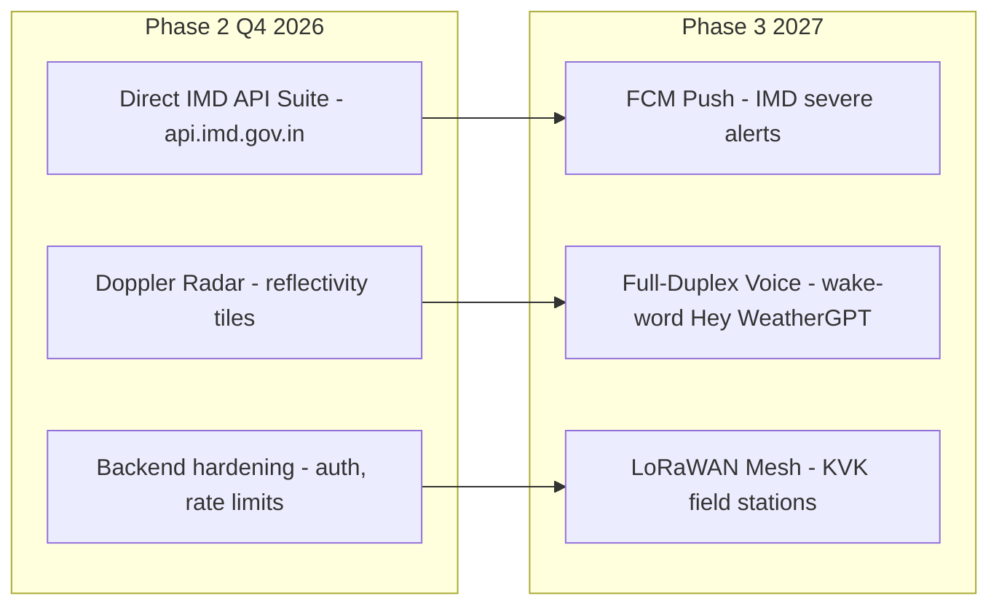

# WeatherGPT Android — Technical Architecture

> **Context**: Smart India Hackathon (SIH 2026) Technical Reference  
> **Problem Statement**: **SIH26068** — Disaster Management Theme  
> **Team**: **visionaries_bvm**  
> **Target Audience**: Evaluation Panel, Technical Judges, Systems Architects  
> **Last Updated**: September 2026  
> **Status**: Source, typecheck, unit tests and Android bundle verified; native release/device acceptance pending  
> **Repository**: One monorepo — React Native (Expo SDK 54) Android client in `app/`, FastAPI backend in `backend/` (no submodules)  
> **Backend URL**: configured per build via `EXPO_PUBLIC_BACKEND_URL`; development default is the Android emulator host `http://10.0.2.2:8888`

---

## Navigation Panel

| # | Section | Status | Key Technologies |
| :--- | :--- | :--- | :--- |
| [1. Executive Summary](#1-executive-summary) | System overview and innovations | Live | Expo SDK 54 (React Native), Zustand 5, fetch |
| [2. High-Level Architecture](#2-high-level-architecture) | Mobile-to-backend topology | Live | Mermaid, FastAPI |
| [3. Technology Stack and Design System](#3-technology-stack-and-design-system) | Frameworks and design tokens | Live | React Native, expo-router, design tokens |
| [4. Repository Structure](#4-repository-structure) | Codebase layout | Live | Feature-first `app/` routes + `src/` modules |
| [5. Environment Variables and Secrets](#5-environment-variables-and-secrets) | Config and credential isolation | Live | EXPO_PUBLIC_BACKEND_URL, backend `.env`, Gradle signing |
| [6. Backend Integration and API Architecture](#6-backend-integration-and-api-architecture) | FastAPI endpoints | Live | FastAPI, /v2/weather, /chat |
| [7. Mobile App Architecture](#7-mobile-app-architecture) | State, routing, persistence | Live | Zustand 5, expo-router 6, AsyncStorage |
| [8. Data Flow and Request Lifecycle](#8-data-flow-and-request-lifecycle) | Request flow and guards | Live | fetch, generation-guarded Zustand stores |
| [9. AI Agent Architecture and Conversational Engine](#9-ai-agent-architecture-and-conversational-engine) | LangGraph and Groq | Live | LangGraph, Groq cascade, keyword routing |
| [10. Provider Selection and Supplementation Engine](#10-provider-selection-and-supplementation-engine) | Ordered selection + supplementation | Live | IMD (scaffold), AccuWeather, Open-Meteo |
| [11. API Contract Reference](#11-api-contract-reference) | REST contract | Live | /chat, /weather, /v2/weather, /advisory |
| [12. Widget Protocol and Dynamic UI Cards](#12-widget-protocol-and-dynamic-ui-cards) | Dynamic markdown cards | Live | widget:weather, widget:forecast, VoiceCard |
| [13. Multilingual Engine and Internationalization](#13-multilingual-engine-and-internationalization) | 9 Indian languages + Voice | Live | typed i18n, expo-speech-recognition, expo-speech |
| [14. Risk Assessment and Environmental Hazard Engine](#14-risk-assessment-and-environmental-hazard-engine) | Hazard advisory | Live | Backend weather thresholds |
| [15. Agricultural Farmer Advisory Mode](#15-agricultural-farmer-advisory-mode) | Farm action windows | Live | Threshold advisory, Farm Action Windows |
| [16. Developer Diagnostics and Debug Suite](#16-developer-diagnostics-and-debug-suite) | 5-tab debug screen | Live | Request log, provider pinning |
| [17. Deployment and Release Architecture](#17-deployment-and-release-architecture) | CI/CD and signing | Live | GitHub Actions, Expo prebuild, Gradle |
| [18. Problem Statement and SIH Compliance Matrix](#18-problem-statement-and-sih-compliance-matrix) | SIH26068 compliance | Live | 10-domain matrix |
| [19. Future Roadmap and Planned Enhancements](#19-future-roadmap-and-planned-enhancements) | Roadmap | Planned | IMD APIs, radar, push, LoRaWAN |

---

## 1. Executive Summary

**WeatherGPT Android** is an AI-powered weather intelligence app built for **SIH 2026** Disaster Management (SIH26068) by **Team visionaries_bvm**.

It translates meteorological telemetry into actionable, hyper-local intelligence in **9 live Indian languages** (bn, en, gu, hi, kn, ml, mr, ta, te) with two-way voice (on-device STT + TTS).

- **Framework**: **React Native (Expo SDK 54)** + TypeScript 5.9 strict; feature-first structure (`app/app/` routes + `app/src/` modules); Android is the release target (a web preview exists for UI work)
- **State**: Zustand 5 stores, Routing: expo-router 6, Persistence: AsyncStorage
- **Backend**: FastAPI in `backend/` of this same repository, deployable to Vercel (project root `backend/`) or Uvicorn
- **Provider selection**: **IMD → AccuWeather → Open-Meteo** ordered policy (IMD is an adapter scaffold; with no keys Open-Meteo serves) with per-field Open-Meteo supplementation and provenance. Legacy weighted fusion (Open-Meteo 2.0×, AccuWeather 1.5×, WeatherAPI 1.2×, Tomorrow.io 1.2×, OWM 1.1×) remains for `GET /fusion` dev diagnostics.

### Core Innovations

- **Persona-Driven UI**:
  - **Everyone**: Hero weather card, tappable hourly / 7-day / metric details, AQI/UV, gradient sky with live particles, voice-first assistant
  - **Farmer (Krishi)**: Farm profile, threshold-based spray/irrigation/field-work windows with hourly bands
  - **Researcher**: Historical archives, deviation charts (react-native-svg `LineChart`/`DeviationBars`), multi-city comparison
- **Voice-First Indic**: STT (`expo-speech-recognition`, capability- and permission-checked) + TTS `expo-speech` mapped to `hi-IN, gu-IN, mr-IN, ta-IN, te-IN, kn-IN, ml-IN, bn-IN, en-US`; typed input is the graceful fallback where STT is unavailable
- **Atmospheric Sky Engine**: 11 solar periods (midnight, predawn, night, sunrise, morning, midday, afternoon, goldenHour, sunset, dusk, evening) and 12 sky conditions (clear, partlyCloudy, cloudy, overcast, fog, drizzle, rain, heavyRain, thunder, snow, windy, unknown) driving gradients, rain streaks, stars and lightning
- **Zero-Guesswork**: Missing values → `null`, not `0 °C / 0 mm`. WMO code `0` = clear sky, `null` = unknown
- **Debug Suite**: 5 tabs — Snapshot, Sources, Providers, Log, Health

---

## 2. High-Level Architecture


```mermaid
graph TB
    subgraph "Android Client - React Native (Expo SDK 54) · app/"
        UI["RN UI - Glassmorphism, Gradient Sky + Particles"]
        NAV["expo-router - /onboarding, (tabs)/home, (tabs)/chat, (tabs)/explore, (tabs)/farm|(tabs)/lab (persona tab), (tabs)/profile, /voice, /debug"]
        STATE["Zustand Stores - weather, chat, voice, farm, settings, dev"]
        CLIENT["ApiClient fetch - Accept-Language header, RequestLog"]
        CACHE["AsyncStorage - settings, farm profile, saved locations"]
        VOICE["Voice Engine - expo-speech-recognition STT + expo-speech TTS"]
        WEBVIEW["Windy Embed - react-native-webview"]
    end

    subgraph "FastAPI Backend · backend/"
        API["FastAPI - CORS *, Request IDs/Logging, Port 8888"]
        RCHAT["routers/chat - POST /chat"]
        RMOB["routers/mobile - GET /weather, /advisory, /historical, /comparison"]
        RV2["routers/weather_v2 - GET /v2/weather, /v2/weather/health"]
        RDEV["routers/dev - GET /health, /dev, /dev/forecast, /fusion, POST /dev/sandbox"]
        CHATSVC["services/chat - Keyword Router, Language Normalizer, Fast Path"]
        SELECT["services/forecast - Ordered Provider Selection"]
        SUPP["services/forecast_supplement - Open-Meteo field fill"]
        ADV["services/advisory - Threshold Bands"]
        AGT["LangGraph Agent - Tool Calling Loop"]
        LLM["Groq Cascade - gpt-oss-120b, qwen3.8/3.6, gpt-oss-20b"]
    end

    subgraph "External Providers"
        OM["Open-Meteo - No Key - Baseline"]
        AW["AccuWeather - Optional Key"]
        IMD["IMD - Scaffold, not implemented"]
        AQI["Open-Meteo Air Quality - AQI, PM2.5"]
        OMA["Open-Meteo Archive - Historical"]
    end

    UI --> NAV
    NAV --> STATE
    STATE --> CLIENT
    STATE --> CACHE
    UI --> VOICE
    UI --> WEBVIEW

    CLIENT --> RMOB
    CLIENT --> RV2
    CLIENT --> RCHAT
    CLIENT --> RDEV

    RCHAT --> CHATSVC
    CHATSVC --> SELECT
    CHATSVC --> AGT
    AGT --> LLM
    AGT --> SELECT
    RMOB --> SELECT
    RV2 --> SELECT
    RMOB --> ADV
    ADV --> SELECT
    SELECT --> SUPP

    SELECT -.-> IMD
    SELECT --> AW
    SELECT --> OM
    SUPP --> OM
    SELECT --> AQI
    RMOB --> OMA
```

The client also calls Open-Meteo geocoding and BigDataCloud reverse-geocoding directly (`src/core/services/geocodingService.ts`). No weather/LLM keys ever ship in the app.

---

## 3. Technology Stack and Design System

### 3.1 Mobile Client (React Native — `app/package.json`)

| Layer | Package | Version | Purpose |
| :--- | :--- | :--- | :--- |
| Framework | expo | ~54.0 (SDK 54) | Runtime and native build tooling (Android; web preview) |
| Language | typescript | ~5.9 (strict) | Typed runtime |
| State | zustand | ^5.0 | Feature stores |
| Routing | expo-router | 6.0 | File-tree routes + `(tabs)` shell |
| HTTP | fetch (global) | — | `ApiClient` wrapper with timeouts + request log |
| Persistence | @react-native-async-storage/async-storage | 2.2.0 | Key-value store |
| i18n | custom engine (`src/i18n`) | — | 9-language JSON bundles, eager-loaded |
| TTS | expo-speech | ~14.0.8 | On-device synthesis with the saved locale and rate |
| STT | expo-speech-recognition | ~3.1.3 | Native recognizer with live interim transcript |
| Native config | expo-build-properties | ~1.0 | Android cleartext policy for local/LAN backends |
| Haptics | expo-haptics | ~15.0.8 | Selection / light / success feedback |
| Typeface | @expo-google-fonts/manrope | ^0.4 | Manrope 300–800, tabular numerals for data |
| Navigation theme | @react-navigation/native | ^7.4 | Transparent dark theme so the sky shows through every route |
| Charts | react-native-svg | 15.12 | Responsive multi-series `LineChart`, `DeviationBars`, sun arc, sky glow |
| GPS | expo-location | ~19.0.8 | Foreground permission + GPS with stale-result guard |
| GIS | react-native-webview | 13.15.0 | Windy.com embed with selected product |
| Gradients | expo-linear-gradient | ~15.0.8 | Atmosphere sky canvas |
| Markdown | custom `RichText` + pure `markdown.ts` parser | — | Headings, lists, quotes, links, code, pipe tables; `widget:` and `"widget_type"` JSON fences dropped |
| Icons | @expo/vector-icons (MaterialCommunityIcons) | ^15.1 | Iconography |
| Tests | vitest | ^5.0 | 153 unit tests: parsers, stores, generation guards, formatting, markdown, device speech, backend contract, i18n completeness, release config |
| Web preview | react-native-web + @expo/metro-runtime | 0.21 / ~6.1 | Browser preview for UI work (not a release target) |
| Animation | react-native-reanimated + react-native-worklets | ~4.1 / `0.5.1` (pinned via `overrides`) | Required by the navigation stack; worklets pinned to the SDK 54-compatible release |

### 3.2 Backend (`backend/requirements.txt`)

| Layer | Technology | Purpose |
| :--- | :--- | :--- |
| Web Framework | FastAPI 0.115 | Async REST API |
| ASGI | Uvicorn 0.30 | Non-blocking server |
| Agent | LangGraph 0.2 | Stateful AI workflow |
| LLM | langchain-groq 0.2 | Low-latency inference (optional) |
| HTTP | httpx 0.27 | Telemetry ingestion |
| Validation | Pydantic | Typed contracts |

### 3.3 Design System (`app/src/ui`)

Semantic tokens live in `src/ui/theme/tokens.ts`; screens import only from `src/ui` (the barrel), never raw hex.

| Token group | Values | Usage |
| :--- | :--- | :--- |
| Canvas | canvas #0A1120, canvasDeep #060B16 | App background under the sky |
| Surfaces | surface rgba(9,15,30,.42), surfaceStrong .62, surfaceInset white 6% | Translucent cards over the live sky; one hairline, no drop shadows |
| Text | text #F8FAFC, secondary 72%, tertiary 50% | Hierarchy by opacity, not hue |
| Accent | teal #2DD4BF (accentText #5EEAD4) | The single accent: primary actions, selection, voice orb |
| Status | good #4ADE80, caution #FBBF24, danger #F87171, info #60A5FA | Semantic only (advisory bands, errors) |
| Personas | farmer #4ADE80, researcher #60A5FA | Persona chips/icons |
| Type scale | display 96 light, largeTitle 30, title 22, headline 17, body 15, callout 14, footnote 12, caption 11, metric 28, numeric 15 (tabular) | Manrope |
| Spacing / radius | 4-pt grid (2–48); radius 6–26 + pill | Consistent gutters (20) and max content width (640) |

Primitives: `AppText`, `Icon`, `Touchable` (press scale/dim + haptics), `Card`/`CardHeader`, `Button`/`IconButton` (44 pt targets), `SegmentedControl`, `Chip`/`ChipGroup`, `SwitchRow`, `ListRow`, `TextField`, `Skeleton`, `StateView`, `InlineBanner`, `Screen`/`Section`, `Sheet` (bottom sheet), `VoiceOrb`. Shell: `SkyBackground` (+ `SkyParticles`), floating `TabBar` with a centre voice button.

---

## 4. Repository Structure

```
weathergpt-android/
├── app/                                   # React Native (Expo) Android client
│   ├── app/                               # expo-router routes
│   │   ├── _layout.tsx                    # Fonts + store hydration, nav theme, live sky (gradient + particles)
│   │   ├── index.tsx                      # Onboarding guard redirect
│   │   ├── onboarding/index.tsx           # Welcome → language → persona → farm (talk / type / skip)
│   │   ├── (tabs)/
│   │   │   ├── _layout.tsx                # Tabs + floating TabBar (persona tabs, centre mic)
│   │   │   ├── home.tsx                   # Hero, voice card, hourly, 7-day, metric tiles, detail sheets
│   │   │   ├── chat.tsx                   # Markdown chat, dictation composer, answers read aloud
│   │   │   ├── explore.tsx                # Full-screen Windy map, layers/models, zoom/locate, Weather Lab link
│   │   │   ├── farm.tsx                   # Farm profile summary + action windows (suitability tracks)
│   │   │   ├── lab.tsx                    # Historical archive, deviation bars, multi-location comparison
│   │   │   └── profile.tsx                # Settings: persona, language, units, voice, developer
│   │   ├── voice.tsx                      # Full-screen voice assistant (listen → answer → read aloud)
│   │   ├── locations.tsx                  # Location picker: search, GPS, saved, popular places
│   │   ├── farm-profile.tsx               # Farm profile editor (form or voice)
│   │   ├── debug.tsx                      # 5-tab debug suite
│   │   └── +not-found.tsx
│   ├── src/
│   │   ├── core/                          # config (apiEndpoints, backendConfig), errors, models, services, utils
│   │   ├── features/
│   │   │   ├── app/bootstrap.ts           # useAppReady (fonts + hydration), context sync, useSkyScene
│   │   │   ├── weather/                   # models, parsers, atmosphereTheme, weatherStore (skyScene), format.ts,
│   │   │   │                              #  components/ (CurrentConditions, AskCard, Hourly/DailyForecast,
│   │   │   │                              #  MetricTiles, DetailSheets, HomeSkeleton)
│   │   │   ├── voice/                     # voiceStore (ask + dictation), voiceCard, response mapper
│   │   │   ├── chat/                      # chatStore; components/ (MessageItem, InsightCard, Composer)
│   │   │   ├── farm/                      # models, farmStores; components/ (FarmProfileForm, FarmVoiceFlow,
│   │   │   │                              #  SuitabilityTrack)
│   │   │   ├── location/                  # locationStore; components/LocationPromptBar
│   │   │   └── settings/, explore/, research/, onboarding/
│   │   ├── i18n/                          # 9 locale JSONs (309 keys each, fully translated) + translator
│   │   ├── ui/                            # Design system: theme/tokens, primitives/, shell/, content/, charts/
│   │   ├── models/location.ts             # Location models + presets
│   │   └── lib/persistence.ts             # AsyncStorage JSON helpers + StorageKeys
│   ├── test/                              # vitest suites, stubs/ (RN, AsyncStorage, speech, location), fixtures/
│   ├── scripts/                           # configure-android-release.cjs (post-prebuild signing), push-all.sh
│   ├── docs/                              # Data contracts, endpoint inventory, device QA checklist
│   └── app.json, app.config.js, package.json, bun.lock, metro/babel/tsconfig/vitest configs
├── backend/                               # FastAPI: main.py, routers/, services/, providers/, agent.py, tools.py, tests/
├── scripts/                               # prepare_android_build.py (CI URL/signing validation) + tests
└── .github/workflows/                     # ci-test, ci-build-signed, build-apk (reusable), nightly-release
```

---

## 5. Environment Variables and Secrets

### Mobile env — `EXPO_PUBLIC_BACKEND_URL` (template: `app/.env.example`)

| Variable | Required | Value | Purpose |
| :--- | :--- | :--- | :--- |
| EXPO_PUBLIC_BACKEND_URL | No (dev) / Yes (release) | `http://10.0.2.2:8888` (Android emulator, default) <br> `http://localhost:8888` (web preview) <br> `http://192.168.x.x:8888` (phone on LAN) <br> `https://…` (deployed backend) | FastAPI base URL. Resolved via `EXPO_PUBLIC_BACKEND_URL` (Metro inlines it at bundle time) > emulator fallback. `resolveBackendUrl()` trims quotes/slashes. There is no hosted default. |

> **Credential Isolation**: No AccuWeather, Tomorrow.io, OpenWeatherMap or Groq keys in the app — only the backend URL, which is readable from the APK. The backend proxies all providers. `ApiClient` sends the base URL + `Accept-Language` from the settings store `language` (default `en`).

### Backend env — `backend/.env` (template: `backend/.env.example`)

| Variable | Effect |
| :--- | :--- |
| GROQ_API_KEY | Optional; blank disables the LLM path (deterministic telemetry chat) |
| GROQ_MODEL | Primary Groq model; default `openai/gpt-oss-120b` |
| WEATHER_PROVIDER_PRIORITY | Ordered provider IDs; default `imd,accuweather,open_meteo` |
| ACCUWEATHER_KEY | Enables the AccuWeather adapter |
| IMD_API_KEY, IMD_JWT_TOKEN | Reserved for the IMD scaffold; do not enable a working feed |
| WEATHERAPI_KEY, TOMORROW_KEY, OPENWEATHER_KEY | Optional legacy `/fusion` diagnostics providers |
| WEATHER_SUPPLEMENT_ENABLED | Open-Meteo secondary-field supplementation (default on) |
| CHAT_FAST_PATH, CHAT_TIMEOUT_SECONDS | Deterministic fast path and agent timeout |

### Android Release Signing

| Secret | Type |
| :--- | :--- |
| KEYSTORE_BASE64 | Base64 keystore |
| KEYSTORE_PASSWORD | Keystore password |
| KEY_ALIAS | Key alias |
| KEY_PASSWORD | Key password |

PR/push CI without secrets produces a clearly labeled **debug-signed** development APK. Partial secrets fail. Nightly releases require all four and never fall back to debug keys.

---

## 6. Backend Integration and API Architecture

### Endpoints

| Path | Method | Used By | Function |
| :--- | :--- | :--- | :--- |
| / | GET | Meta | Service index and supported client/policy description |
| /chat | POST | Chat + Voice | Conversational AI. Body: message, messages, location, lat, lon, language, mode, farmer_mode, crop, growth_stage, soil, irrigation. Returns {response: markdown, meta: {path, client, language, location, intent, intent_engine, intent_confidence}, card?} |
| /weather | GET | Mobile legacy fallback | Home snapshot: current, hourly, daily forecast, AQI, UV, sunrise/sunset, provenance |
| /v2/weather | GET | Mobile primary | Same service as `/weather`: lat, lon, mode, requested_source (auto/open_meteo/accuweather/imd), forecast_days, hourly_hours, supplement. Returns flat current fields + hourly, forecast, selected_source, provenance, field_sources |
| /v2/weather/health | GET | Debug | Configuration-only health: provider priority and eligibility (not a live probe) |
| /advisory | GET | Farmer | Day-by-day suitability; hourly buckets (irrigation/spraying/field_work) for the first two days; threshold engine |
| /historical | GET | Researcher | {metric, points: [{year, value}]} |
| /comparison | GET | Researcher | {metric, locations: [{name, points}]}; locations=name,lat,lon;... (names may contain commas) |
| /fusion | GET | Dev only | Legacy weighted inspector: provider values, weights, outlier flags. Not in `ApiEndpoints` |
| /health | GET | Mobile | {status: ok} |
| /dev | GET | Debug | Diagnostics: provider key status, recent logs |
| /dev/forecast | GET | Debug | Provider selection check |
| /dev/sandbox | POST | Debug | Single-prompt agent sandbox with latency (billable when Groq is enabled) |

Removed or unknown `requested_source` values (e.g. `weathernext`) are rejected with **422**; a pinned provider that cannot serve returns **502 unavailable** rather than silently substituting another provider.

### Chat Lifecycle


```mermaid
sequenceDiagram
    actor User
    participant UI as Chat/Voice screen
    participant Client as ApiClient (fetch)
    participant Router as routers/chat
    participant Service as services/chat
    participant Agent as LangGraph Agent
    participant Select as services/forecast

    User->>UI: Query "Will it rain on my wheat crop?"
    UI->>Client: POST /chat + Accept-Language + mode + farm context
    Client->>Router: POST /chat {message, location, lat, lon, mode, crop}
    Router->>Service: handle_chat_request

    Service->>Service: Keyword intent routing + domain boundary

    alt Greeting / off-topic
        Service-->>Client: Local reply
    else Simple weather (fast path)
        Service->>Select: Select provider + fetch
        Select-->>Service: Normalized forecast + provenance
        Service-->>Client: Markdown + widget:weather
    else Complex / Multilingual / Agri (Groq configured)
        Service->>Agent: run_weather_agent
        Agent->>Select: Tools ingest telemetry
        Select-->>Agent: Live telemetry
        Agent-->>Service: Synthesized answer + widgets
        Service-->>Client: {response, meta, card?}
    end

    Client-->>UI: ChatMessage
    UI->>User: Render markdown + TTS
```

---

## 7. Mobile App Architecture


```mermaid
graph TD
    VIEWS["Screens - Home, Chat, Explore, Farm, Lab, Voice, Debug"]
    WIDGETS["Components - CurrentConditions, SkyParticles, DetailSheets, SuitabilityTrack, VoiceOrb"]
    STORES["Stores - weatherStore, chatStore, actionWindowsStore, settingsStore, voiceStore"]
    PARSERS["Parsers - weatherParser, weatherV2Parser, jsonValues"]
    MODELS["Models - WeatherSnapshot, DayDecision, VoiceCard, Provenance"]
    SERVICES["Services - ApiClient, GeocodingService, RequestLog"]
    STORAGE["AsyncStorage - Settings, Locations, FarmProfile"]
    HARDWARE["Device - expo-location, expo-speech-recognition, expo-speech"]

    VIEWS --> WIDGETS
    VIEWS --> STORES
    WIDGETS --> STORES
    STORES --> HARDWARE
    STORES --> SERVICES
    SERVICES --> PARSERS
    PARSERS --> MODELS
    STORES --> STORAGE
```

### State Management (Zustand 5 — `app/src/features/**`)

- **useWeatherStore** (`weatherStore.ts`): fetches on context change (location, mode, request-affecting dev options). Tries `/v2/weather` primary, falls back to `/weather` legacy (carrying the same horizons/supplement) only for `auto` requests and unless `disableV2Fallback`. Records `lastRequest` and `updatedAt`. A refresh of the same request (`snapshotKey`) keeps the current snapshot visible; a new location/mode clears it. Also hosts `skyScene(now, snapshot, dev)` → {period, sky, palette} used by the app-wide sky.
- **useChatStore**: message history, sending flag, intent meta, generation guard; root synchronizes location/mode/language/completed farm context; changing context resets the conversation, and retry replaces the failed user turn
- **useActionWindowsStore** (`farmStores.ts`): farm suitability — keyed by `contextKeyOf` = `mode|lat,lon|crop|stage|soil|irrig|UTCdate`, generation guard, per-tab cache, explicit unavailable state
- **useSettingsStore**: language, persona (validated, unknown values rejected), units, TTS locale and speed, per-language device voice picks (`ttsVoices`) — persisted to AsyncStorage
- **useDeveloperOptionsStore**: DevSourcePin (auto/open_meteo/accuweather/imd; stale stored pins fall back to auto), hourly 1–168, forecast 1–15, supplement toggle, disable-v2-fallback, log-requests, provenance display, animated-sky switch, forced sky period/condition
- **useFarmProfileStore** (`farmStores.ts`): FarmProfile + explicit-saved completion flag. Saves validate farm size and resolve the place into active coordinates; unsaved profiles are not sent as real farm context
- **useOnboardingStore**: language/persona selection; completion writes language + TTS locale + persona + completion flag, then re-hydrates the settings store so the first home fetch already uses the chosen mode
- **useVoiceStore**: two modes — `startListening` (full assistant turn → /chat → mapped answer) and `startDictation(onText)` (chat composer, farm voice onboarding). The device recognizer provides the live and final transcript; `speak()` uses `expo-speech` with the saved locale and rate. Generation guard on cancel/context changes.
- **useMapStore / useSavedLocationsStore** (`exploreStores.ts`): Windy layer/product/zoom, researcher menu/marker toggles, embed URL + Weather Lab URL builders, saved locations
- **researchStores**: `/historical` + `/comparison` fetchers, `ArchiveStatus` (available/empty/unsupported), deviation display statistics
- **useRequestLogStore** (`core/services/requestLog.ts`): ring buffer of the last 60 requests

### Correctness boundaries

- Weather clear/context requests invalidate old generations; explicit unavailable
  responses and pinned-source failures never silently switch providers. New requests clear old-location data.
- Missing tomorrow windows are unavailable, never copied from today; missing
  best-window labels do not imply good conditions.
- HTTP timeout covers headers **and** body, and malformed/non-object JSON success
  responses fail rather than parse to an empty success object.
- The root `index.tsx` redirects to onboarding or Home; the root layout respects Android
  insets; Everyone has neither the Farmer nor Researcher specialized tab.
- Home unit display converts Celsius to Fahrenheit only at the presentation layer.
  The atmosphere clock uses the selected location's offset when provided.

### Null Semantics

- `src/core/models/jsonValues.ts`: absent, wrong-typed, blank, NaN, Infinity → `null`
- WMO code `0` = clear sky. Missing code → `null` → `SkyCondition.unknown`, not clear
- Hourly buckets without temperature dropped, not rendered at 0

---

## 8. Data Flow and Request Lifecycle


```mermaid
sequenceDiagram
    actor User
    participant App as Home screen
    participant Store as weatherStore (zustand)
    participant Client as ApiClient (fetch)
    participant APIv2 as /v2/weather
    participant API as /weather legacy

    User->>App: Open or pull-to-refresh
    App->>Store: fetchWeather(location, mode, dev)
    Store->>Client: GET /v2/weather {lat, lon, mode, requested_source=auto, forecast_days=7, hourly_hours=48}
    Client->>APIv2: HTTP GET

    alt v2 Success
        APIv2-->>Client: 200 {current fields, hourly, forecast, selected_source, provenance, field_sources}
        Client->>Store: JSON
        Store->>Store: parseWeatherSnapshotV2
        Store-->>App: snapshot + lastRequest
    else v2 Fail + auto source + Fallback Enabled
        Client->>API: GET /weather (same horizons/supplement)
        API-->>Client: 200 legacy
        Store->>Store: parseWeatherSnapshot
        Store-->>App: snapshot + usedLegacyFallback=true
    else Pinned source unavailable / Offline
        Client-->>Store: Error (with provider reasons)
        Store-->>App: error -> retry state
    end

    App->>App: Evaluate SkyCondition 12 + SolarPeriod 11 via atmosphereTheme
    App->>App: Render CurrentConditions over the gradient sky + particles
```

**Generation Guarding**: Each request increments a generation ID; stale responses are discarded. Used in `chatStore`, `voiceStore`, `actionWindowsStore` and `weatherStore`.

---

## 9. AI Agent Architecture and Conversational Engine

- **LangGraph**: Stateful cyclic graph controlling the tool-calling loop; the same tool registry binds Groq tools and executes calls (geocoding, current/daily/hourly weather, AQI, UV/sun, wind/pressure, agricultural telemetry, hazard guidance)
- **Groq Cascade**: Primary `GROQ_MODEL` (default `openai/gpt-oss-120b`) → fallbacks `qwen/qwen3.8-27b`, `qwen/qwen3.6-27b`, `openai/gpt-oss-20b`, `openai/gpt-oss-safeguard-20b` → deterministic telemetry synthesizer. Missing key, failure or timeout falls back to telemetry.
- **Intent Routing**: Keyword classification (`intent_engine: keywords`) into weather/agri/greeting/off-topic routes, with an early deterministic domain boundary. Fast path (simple weather) → direct provider data, no agent. Complex → agent. Explicit source pins use the constrained deterministic path.
- **Indic Extraction**: Regex + prompt heuristics for Hindi/Gujarati/Marathi city phrases: `"delhi me kal barish hogi?"` → Delhi coords.


```mermaid
graph TD
    Q["User Query"] --> M1["gpt-oss-120b"]
    M1 -->|429/Error| M2["qwen3.8-27b"]
    M2 -->|Error| M3["qwen3.6-27b"]
    M3 -->|Error| M4["gpt-oss-20b"]
    M4 -->|Error| M5["gpt-oss-safeguard-20b"]
    M5 -->|All Fail / Timeout| DET["Deterministic Telemetry Synthesizer"]
```

---

## 10. Provider Selection and Supplementation Engine

### Production Policy (Live)

| Priority | Provider | Key | Role |
| :--- | :--- | :--- | :--- |
| 0 | IMD | IMD_API_KEY / JWT | Adapter scaffold; endpoint integration pending |
| 1 | AccuWeather | ACCUWEATHER_KEY | Current + daily (no hourly fetch), RealFeel |
| 2 | Open-Meteo | None | Keyless baseline + supplement (sunrise, UV, AQI, humidity) |

**Flow**:
- App sends `requested_source`: `auto` (backend policy) or pinned (`open_meteo`, `accuweather`, `imd`) via `DevSourcePin`. All personas default to `auto`.
- Backend returns `selected_source`, `requested_source`, `fallback_reasons[]`, `providers_used`, `provenance {...}` and `field_sources: {temperature_c: "open_meteo", uv_index: …, _supplement: {provider, enabled, attempted, filled[], errors[]}}`
- Open-Meteo timestamps are converted zone-aware to UTC with timezone metadata; nulls are preserved (no dry/clear defaults).
- `FieldSources` keeps per-field attribution; "via Open-Meteo" badges, the home status line and source rows in detail sheets render **only in developer mode** — regular users see no provenance UI on the home screen
- `degraded` reflects a configured provider failing or stale data, not IMD being skipped for a missing key
- Total failure returns **502** with an unavailable detail — never a synthetic sunny/zero-rain snapshot

### Legacy Weighted Fusion (Dev Inspector `GET /fusion`)

| Provider | Weight | Key |
| :--- | :--- | :--- |
| Open-Meteo ECMWF | 2.0× | None |
| AccuWeather | 1.5× | ACCUWEATHER_KEY |
| WeatherAPI | 1.2× | WEATHERAPI_KEY |
| Tomorrow.io | 1.2× | TOMORROW_KEY |
| OpenWeatherMap | 1.1× | OPENWEATHER_KEY |

Formula: `M = sum(M_i * W_i) / sum(W_i)`  
Outlier guard: `|T_i - T_OpenMeteo| > 7°C` → excluded  
Confidence: High ≤1.5°C spread, Medium 1.5-3.5°C, Low >3.5°C, Single-Source

Exposed via `backend/routers/dev.py` for diagnostics only; mobile home uses ordered selection.

---

## 11. API Contract Reference

### POST /chat

Request:
```json
{
  "message": "Is it safe to spray pesticide on my cotton crop today?",
  "messages": [{"role": "user", "content": "Is it safe to spray pesticide on my cotton crop today?"}],
  "location": "Rajkot, Gujarat",
  "lat": 22.3039,
  "lon": 70.8022,
  "mode": "farmer",
  "farmer_mode": true,
  "crop": "Cotton",
  "growth_stage": "Flowering",
  "soil": "Black cotton soil",
  "irrigation": "Drip"
}
```

Response:
```json
{
  "response": "## Advisory for Cotton in Rajkot\n\n```widget:weather\n{\"city\": \"Rajkot\", \"temp\": 31.2, \"feelsLike\": 34.0, \"condition\": \"Partly Cloudy\", \"humidity\": 62, \"windSpeed\": 11.5, \"advisory\": \"Safe for spraying 7:00-10:30 AM\"}\n```\n\nWind <15 km/h, no heavy rain next 24h.",
  "meta": {
    "path": "agent",
    "client": "mobile",
    "language": "en",
    "location": "Rajkot, Gujarat",
    "intent_engine": "keywords",
    "intent_confidence": null
  }
}
```

### GET /v2/weather (Primary)

Query: `lat, lon, mode=everyone|farmer|researcher, requested_source=auto|open_meteo|accuweather|imd, forecast_days=7 (1–16), hourly_hours=48 (1–168), supplement`

Response (flat): `temperature_c, feels_like_c, condition, weather_code, high_c, low_c, rain_probability, wind_kmh, wind_direction, humidity, pressure_hpa, precipitation_mm, uv_index, sunrise, sunset, aqi, pm2_5, hourly[], forecast[], timezone, location, selected_source, requested_source, providers_used, fallback_reasons, provenance, field_sources, fetched_at, mode`

### GET /weather (Legacy fallback)

Same service and shape as v2; kept version-less for backward compatibility.

### Other Endpoints

- `/advisory?lat=&lon=&crop=&growth_stage=&soil=&irrigation=&days=&source=&mode=` → `{crop, summary, windows: [{date, suitability, summary, best_window, rain_probability, rain_mm, wind_kmh_max, high_c, hourly: {irrigation, spraying, field_work: [{hour, suitability}]}}], advisory_engine: "thresholds", ai: {enabled: false, applied: false}, source, provenance}`
- `/historical?lat=&lon=&metric=&start_year=&end_year=` → `{metric, points: [{year, value}]}`
- `/comparison?locations=name,lat,lon;...&metric=` → `{metric, locations: [{name, points}]}`
- `/v2/weather/health` → `{check: "configuration_only", provider_priority, provider_health}`
- `/health` → `{status: ok}`
- `/dev` → diagnostics
- `/dev/sandbox` POST `{prompt, location, language}` → `{status, duration_ms, response, model_used}`

There is no `/voice` endpoint: STT produces text for `/chat`, and TTS reads the answer on-device.

---

## 12. Widget Protocol and Dynamic UI Cards

The backend may embed native-card payloads in markdown via code fences. The app strips them from the prose; structured cards arrive in the separate `card` field and render as `InsightCard`.

| Tag | App handling | Purpose |
| :--- | :--- | :--- |
| ```widget:weather | Stripped from display and speech | Temp, condition, humidity, wind, advisory |
| ```widget:forecast | Stripped from display and speech | Multi-day strip |
| `card` (JSON field) | `InsightCard` in chat, result card in voice | Verdict, stats, forecast rows |

Sanitization: `src/core/utils/markdownUtils.ts` strips widget blocks for TTS via `forSpeech()` (tables flattened into spoken prose, LaTeX delimiters removed). Display rendering goes through the shared `RichText` component (`src/ui/content/RichText.tsx`, parser `src/ui/content/markdown.ts`): headings, bold/italic, inline code, bullet lists, styled blockquotes and links, with `widget:`/`json` fence stripping so native-card instructions never leak into the conversation. Chat and all AI surfaces share this one renderer.

### VoiceCard (Structured)

When a voice query is initiated, the backend may return:

```json
{
  "response": "Favorable conditions for wheat irrigation this morning.",
  "card": {
    "label": "Irrigation Outlook",
    "verdict": "Favorable for Irrigation",
    "explanation": "Wind calm <10 km/h and no rain expected.",
    "cta_label": "Schedule Drip Irrigation",
    "source": "Open-Meteo",
    "confidence": 0.88,
    "stats": [
      {"label": "Wind Speed", "value": "8 km/h", "tone": "good"},
      {"label": "Rain Risk", "value": "10%", "tone": "good"}
    ],
    "forecast": [
      {"day": "Today", "temperature": "32°C", "rainfall": "0 mm", "condition": "sunny"}
    ]
  }
}
```

`mapBackendAnswer` (`src/features/voice/mappers/voiceResponseMapper.ts`) maps the answer onto the result card. If no card, renders prose only — no fabricated stats. `CardTone`: `good|caution|avoid` (aliases: safe, favourable, watch, risk, poor).

---

## 13. Multilingual Engine and Internationalization

9 live languages (Punjabi planned):

| Language | ISO | Script | TTS Locale | STT Model | File |
| :--- | :--- | :--- | :--- | :--- | :--- |
| English | en | English | en-US / en-IN | en_US | en.json |
| Hindi | hi | हिंदी | hi-IN | hi_IN | hi.json |
| Gujarati | gu | ગુજરાતી | gu-IN | gu_IN | gu.json |
| Marathi | mr | मराठी | mr-IN | mr_IN | mr.json |
| Tamil | ta | தமிழ் | ta-IN | ta_IN | ta.json |
| Telugu | te | తెలుగు | te-IN | te_IN | te.json |
| Bengali | bn | বাংলা | bn-IN | bn_IN | bn.json |
| Kannada | kn | ಕನ್ನಡ | kn-IN | kn_IN | kn.json |
| Malayalam | ml | മലയാളം | ml-IN | ml_IN | ml.json |

- **Storage**: `app/src/i18n/locales/<iso>.json`, eager-loaded by the typed i18n engine
- **UI binding**: `useTranslation` re-renders labels when the language changes. All user-facing screens use translation keys (developer-only Debug/Developer copy stays English).
- **Voice**: On-device engines (`expo-speech-recognition`, `expo-speech`); language coverage depends on the engines installed on the phone. The onboarding farm voice flow speaks and listens in the chosen language.
- **Header**: `ApiClient` attaches `Accept-Language: <iso>` from the settings store
- **Speech Cleanup**: `MarkdownUtils.forSpeech()` strips markdown, emojis, URLs, widget blocks before TTS
- **Keyset guarantee**: the vitest i18n tests assert every locale resolves the full English key set (309 keys) and translates every key
- Some deterministic server replies remain English.

---

## 14. Risk Assessment and Environmental Hazard Engine

Hazard handling is **backend-driven**, not a custom in-app RED/YELLOW/GREEN threshold engine.

- **Sources**: advisory suitability `good|caution|avoid|neutral` from rain/wind/temperature thresholds, weather-derived hazard guidance in chat, markdown warnings
- **Rendering**: Color-coded status via the design-system `good/caution/danger` tokens
- **Missing inputs**: Missing daily critical inputs produce a neutral/unavailable verdict (`insufficient_data`), never a positive recommendation; heat never overrides a worse rain-risk band
- **Official IMD warnings are not implemented**: an unknown alert status means *unknown*, never "no danger". Suggestions are not certified emergency bulletins.

---

## 15. Agricultural Farmer Advisory Mode

### Threshold Advisory Engine

- **Server**: `backend/services/advisory.py` hourly bands, `backend/routers/mobile.py` `/advisory`
- **Engine**: `advisory_engine: "thresholds"`, `ai.enabled/applied = false`. Crop labels are accepted, but it is not a crop/soil/stage-calibrated agronomy model; stored profile details reach LLM context in chat
- **Per-Day Decision**: Each day renders its own `windows[i]` suitability, never a global aggregate
- **No Bundled Offline Advisory**: Backend unreachable → explicit unavailable state, never empty neutral bars. Cache keyed on `mode|lat,lon|crop|stage|soil|irrig|UTCdate`, discarded on move/profile edit/midnight (`unavailableActionWindows` + `contextKeyOf` in `src/features/farm/farmStores.ts`)

### Farm Profile Onboarding & Settings

- Picking **Farmer** in onboarding (`app/app/onboarding/index.tsx`) adds a farm step with a Talk-vs-type choice: the `FarmProfileForm` form or the `FarmVoiceFlow` voice conversation; skipping keeps the default profile. The same data feeds `GET /advisory` and `POST /chat` farm context.
- Voice onboarding is a scripted on-device loop, not a backend chat. Parsing (en/hi/gu aliases, romanized forms, fuzzy longest-phrase match, Indic-digit sizes) lives in `src/features/farm/models/farmVoiceParser.ts` and is unit-tested.
- Option catalogs live in `src/features/farm/models/farmOptions.ts` and are shared with the profile editor via `withCurrentOption`, so a stored value is never missing from its picker. Catalog strings are backend wire values and stay in English; only field labels are localized.
- **Profile → Farm profile** (farmer persona) shows the saved summary or a "Complete your farm profile" prompt; switching to farmer with an incomplete profile opens the editor directly.

### Farm Action Windows

3 tracks (irrigation, spraying, field work) of hourly bands for the first two days, e.g.:

```
[00:00-04:00] Avoid   (Heavy Dew / High Humidity)
[04:00-08:00] Good    (Low Wind <8 km/h) <- Optimal Spray
[08:00-12:00] Caution (Rising Thermal)
[12:00-16:00] Avoid   (Peak Solar / Evaporation)
[16:00-20:00] Good    (Calm Evening)
[20:00-24:00] Neutral (Night Rest)
```

### Supported Crops

| Crop | Vulnerability | Focus |
| :--- | :--- | :--- |
| Cotton | Bollworm, water-logging | Spray windows, drainage, dry picking |
| Wheat | Heat stress, lodging | Irrigation milestones, heading protection |
| Rice / Paddy | Water depth, blast fungus | Water level, fertilizer timing |
| Sugarcane | Stem lodging | Irrigation cycling, propping during gusts |
| Groundnut | Tikka leaf spot, pod rot | Moisture balance, drying windows |
| Mustard | Aphid during overcast | Spray timing, cold snap warnings |
| Vegetables | Blight, desiccation | Drip scheduling, shade management |

---

## 16. Developer Diagnostics and Debug Suite

Enable via **Profile → Developer → Developer mode → Debug & state** (`/debug`) — 5 tabs:

| Tab | Capability | Details |
| :--- | :--- | :--- |
| 1. Snapshot | Raw JSON inspector | Parsed fields, highs/lows, rain prob, solar timings |
| 2. Sources | Per-field attribution | `via Open-Meteo`, supplemented values highlighted |
| 3. Providers | Chain & degradation | Tried providers, real failures, skipped (unconfigured), missing fields, policy version, freshness |
| 4. Log | Ring-buffer log | Last 60 HTTP calls, status, duration ms, query |
| 5. Health | Backend probe | `/v2/weather/health` configuration check |

**Controls (Profile → Developer)**:
- Pin source: `DevSourcePin` auto/open_meteo/accuweather/imd — forces a provider and surfaces failures
- `Show provenance on Home` restores the source/run/freshness chips on the home screen (developer mode only; provider names never render for regular users)
- `Disable animated sky` switches to the gradient-only background

Stored options without a settings control (hourly 1–168, forecast 1–15, supplement, disable-v2-fallback, log-requests, forced sky period/condition) apply only with developer mode on and are shown in the Debug state.

---

## 17. Deployment and Release Architecture


```mermaid
graph LR
    subgraph "CI ci-test.yml"
        T0["Python 3.11 backend contracts (offline)"]
        T1["Node 22 + Bun 1.4.2"] --> T2["frozen install"]
        T2 --> T3["strict tsc + Vitest"]
        T3 --> T4["Expo Android bundle export"]
        T5["actionlint + build-script tests"]
    end
    subgraph "CI ci-build-signed.yml → build-apk.yml"
        A1["validate URL/signing"] --> A2["Expo prebuild Android"]
        A2 --> A3["Gradle assembleRelease → release.apk artifact"]
    end
    subgraph "CD nightly-release.yml — 00:00 IST"
        N1["recent commits? gate"] --> N2["ci-test"]
        N2 --> N3["build-apk: HTTPS URL + stable key required"]
        N3 --> N4["GitHub prerelease nightly-YYYYMMDD: release.apk"]
    end
```

- PRs and pushes run tests, then the APK build. PR builds never receive keystore
  credentials; builds without secrets are labeled **debug-signed** (plus
  `local-backend` without a URL) development artifacts.
- Nightly runs at **18:30 UTC / 00:00 IST** on the default branch when there are
  commits in the last 24 hours; manual dispatch bypasses only the activity gate.
- Stable release signing requires `KEYSTORE_BASE64`, `KEYSTORE_PASSWORD`,
  `KEY_ALIAS`, `KEY_PASSWORD`; missing/partial secrets fail closed (no debug fallback).
  The keystore is written outside the generated `android/` with an absolute path,
  `configure-android-release.cjs` wires Gradle to read passwords from the environment,
  and signing material is removed even after failure.
- Public backend URL comes from the `BACKEND_URL` repository variable (or secret);
  nightlies require HTTPS and reject local/placeholder URLs. `scripts/prepare_android_build.py`
  writes it to `app/.env` as `EXPO_PUBLIC_BACKEND_URL`.
- `app.config.js` validates the Android version code. CI and nightly share a
  seconds-since-2020 version code; version name = `1.0.0-nightly.YYYYMMDD` (UTC).
  Tags are immutable and target the tested commit.
- Android identity is **`com.weathergpt.weathergpt_mobile`**. Upgrades need the same
  certificate; settings from earlier builds are not migrated into AsyncStorage.
- The backend deploys separately (Vercel project root `backend/`, `api/index.py`
  + `vercel.json` rewrites, or Uvicorn). No workflow deploys it.

---

## 18. Problem Statement and SIH Compliance Matrix

### SIH26068 Key Requirements

| Requirement | Implementation | Status | Source |
| :--- | :--- | :--- | :--- |
| Real-Time Telemetry | Temp, humidity, pressure, wind, UV, AQI via ordered providers + supplementation | Live | weatherParser.ts / weatherV2Parser.ts, services/forecast |
| Natural Language Querying | LangGraph + Groq cascade, deterministic fallback | Live | chatStore.ts, agent.py |
| NWP Integration | ECMWF-based forecasts via Open-Meteo; Windy model layers | Live | providers/open_meteo.py, explore |
| Extreme Weather Warnings | Threshold advisory bands, hazard guidance in chat | Partial (no official IMD alerts) | advisory.py, tools.py |
| Agricultural Advisories | GPS + Farmer Mode + threshold action windows | Live | features/farm, /advisory |
| Multilingual Support | 9 live languages + Accept-Language + STT/TTS | Live | src/i18n, voiceStore.ts |
| Historical Trends | Yearly archive series, deviation charts, comparison | Live | features/research, /historical |
| Voice Accessibility | Hands-free STT, TTS, forSpeech cleanup | Live | features/voice, markdownUtils.ts |

### 10-Domain Use Cases

| Domain | Stakeholders | Telemetry | Capability |
| :--- | :--- | :--- | :--- |
| Agriculture | Farmers, KVK | Rain prob, wind, temp, humidity | Threshold crop activity windows |
| Disaster Management | NDRF/SDRF, Collectors | Extreme rain, wind gusts, WMO codes | Hazard guidance, voice answers |
| Urban Health | Municipalities, Citizens | AQI, PM2.5, UV, heat | Exposure warnings |
| Aviation & Drones | Pilots, Operators | Cloud cover, pressure, wind vectors | Windy GIS: cloud, isobar, gust maps |
| Coastal Fisheries | Fishermen, Ports | Squally winds, pressure drop | High-wind advisories, voice bulletins |
| Renewable Energy | Solar/Wind Operators | UV, wind | Solar/wind outlook |
| Logistics & Transport | Fleet, Highway Police | Fog codes, precipitation | Rainfall, fog advisories |
| Construction & Mining | Engineers, Safety | Thunder codes, gusts | Wind and rain checks |
| Mountain Tourism | Pilgrims, Hikers | Sub-zero, snowfall, pressure trends | Pass weather guides |
| Climate Research | Climatologists, Labs | Multi-year rainfall, temperature | SVG LineChart deviation, multi-city comparison |

---

## 19. Future Roadmap and Planned Enhancements


```mermaid
graph LR
    subgraph "Phase 2 Q4 2026"
        R1["Direct IMD API Suite - api.imd.gov.in"]
        R2["Doppler Radar - reflectivity tiles"]
        R3["Backend hardening - auth, rate limits"]
    end
    subgraph "Phase 3 2027"
        R4["FCM Push - IMD severe alerts"]
        R5["Full-Duplex Voice - wake-word Hey WeatherGPT"]
        R6["LoRaWAN Mesh - KVK field stations"]
    end
    R1 --> R4
    R2 --> R5
    R3 --> R6
```

- **IMD Direct APIs**: implement the existing adapter scaffold — City Forecast, District Warning, Cyclone Track, Agromet, Marine Bulletins
- **Doppler Radar**: Live DWR composite tiles for sub-30 min nowcasting
- **Backend hardening**: authentication for `/dev*` and billable routes, rate/resource limits, deployment-specific CORS
- **LoRaWAN**: Low-cost field stations at KVKs for micro-climate ground truth
- **Voice**: On-device wake-word, full-duplex streaming
- **Push**: FCM-based IMD severe alerts

---

**Team**: visionaries_bvm  
**Repository**: `app/` (React Native Android) + `backend/` (FastAPI) in one monorepo  
**Mobile**: React Native (Expo SDK 54) / TypeScript 5.9 / Zustand 5 / expo-router 6 / AsyncStorage  
**Docs**: `app/docs/app_data_contracts.md` (authoritative mobile contract), `app/docs/web_app_api_contract.md` (endpoint inventory), `app/docs/qa_notes.md` (device QA)
