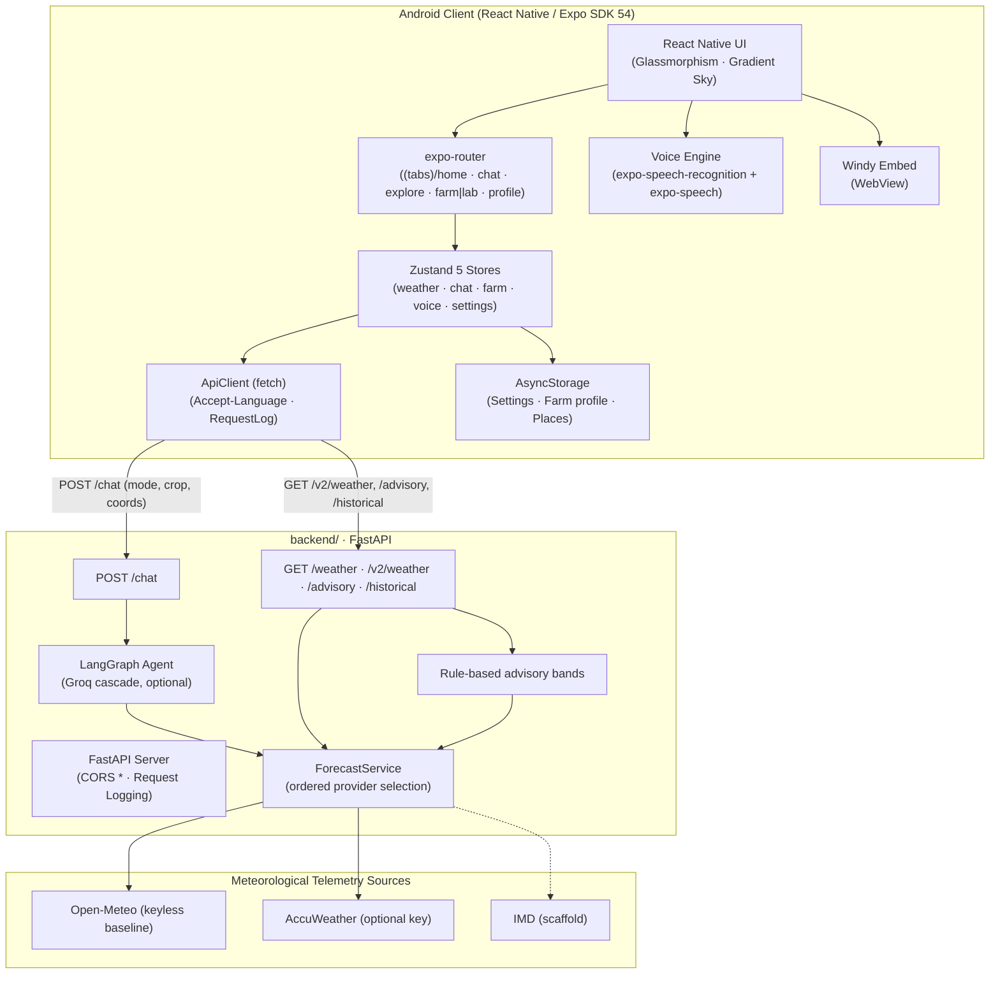

# 🌤️ WeatherGPT Android — AI-Powered Weather Intelligence

[](https://www.sih.gov.in/)
[](https://www.sih.gov.in/)
[](https://www.sih.gov.in/)
[](https://reactnative.dev)
[](https://fastapi.tiangolo.com)
[](https://langchain-ai.github.io/langgraph/)

> **Smart India Hackathon (SIH 2026)** | Problem Statement **SIH26068**  
> **Theme**: Disaster Management & Meteorological Intelligence  
> **Monorepo**: Android app in [`app/`](app/) + FastAPI backend in [`backend/`](backend/) — one Git repository, no submodules  
> **Full Architecture Specifications**: [**`ARCHITECTURE.md`**](ARCHITECTURE.md)

---

## 📱 Quick Start for Judges & Evaluators

### ⚡ Method 1: Download a Built APK (Recommended)

A **Nightly Release APK** workflow builds a signed APK at **00:00 IST (18:30 UTC)**
on days when the default branch has new commits (manual dispatch always runs).

1. Open the repository's **Releases** page.
2. Download **release.apk** directly to your Android phone; no extraction needed.
3. Enable “Install unknown apps” for your browser if prompted, then install.

Nightlies are **prereleases** and require the `BACKEND_URL` repository variable
(HTTPS) plus the four signing secrets (see [CI & signing](#-ci-and-signed-nightly-setup)).

**CI Build APK** also produces a release-mode APK artifact for every PR and push.
Without signing secrets it is clearly labeled **debug-signed** (and
`local-backend` when no backend URL is configured): a developer build, not a
distributable release.

### 🔧 Method 2: Build Locally (Android)

Prerequisites: Node.js 22.13+, Bun 1.4.2, JDK 17, Android SDK/Studio.

```bash
git clone https://github.com/omsenjalia/weathergpt-android.git
cd weathergpt-android/app
bun install
# Configure the backend URL (only config the app needs):
cp .env.example .env          # edit EXPO_PUBLIC_BACKEND_URL if needed
bunx expo prebuild -p android # generates the native android/ project
bun run android               # native build + install + Metro (device/emulator required)
# Or compile only: cd android && ./gradlew assembleRelease
# APK: android/app/build/outputs/apk/release/app-release.apk (debug keys unless signed)
```

`EXPO_PUBLIC_BACKEND_URL=http://10.0.2.2:8888` reaches your machine from an Android
emulator; there is **no implicit hosted fallback**. `EXPO_PUBLIC_*` values are
inlined into the APK's JS bundle — never put keys there.

### 🖥️ Method 3: Run the Backend Locally

Python **3.11**, from the repository root:

```bash
python3 -m venv .venv && source .venv/bin/activate
pip install -r backend/requirements-dev.txt
cp backend/.env.example backend/.env
cd backend && uvicorn main:app --host 0.0.0.0 --port 8888 --reload
```

Open `http://localhost:8888/docs`. Open-Meteo needs internet but no key. Leave
`GROQ_API_KEY` blank for deterministic telemetry chat. AccuWeather is optional; IMD
is an adapter scaffold. Provider keys stay server-side.

### 💻 Method 4: Run the Dev Server (Web preview / Metro)

```bash
cd app
bun install
bun run start          # Expo dev server (press a for Android, w for web preview)
bun run typecheck      # tsc --noEmit, strict
bun run test           # vitest — 153 unit tests over the app logic
```

---

## 🌟 What is WeatherGPT Android?

WeatherGPT transforms complex meteorological telemetry into actionable, hyper-local
intelligence rendered in **9 live Indian regional languages (10th Punjabi planned)** with
two-way voice capabilities (on-device Speech-to-Text and Text-to-Speech).

Unlike standard weather apps that display rigid, confusing numbers, WeatherGPT empowers
citizens, farmers, and researchers with:

- **Natural Language Conversational Assistant**: Ask weather questions in your
  regional mother tongue (*"Will it rain on my cotton crop in Rajkot tomorrow?"*).
- **Farm Action Windows**: Server-side weather thresholds and hourly activity bands
  for spraying, irrigation and field work.
- **Provider Selection with Provenance**: **IMD → AccuWeather → Open-Meteo** ordered
  policy (Open-Meteo is the keyless default) with per-field supplementation and
  provenance tracking (see `app/docs/app_data_contracts.md`).
- **Dynamic Live Atmospheric Sky**: 11 solar periods and 12 weather conditions driving
  smooth gradient transitions with animated rain, stars and lightning.
- **Interactive Windy GIS Maps**: Full-screen radar, satellite, wind stream, and cloud
  cover layers embedded directly in the app.
- **Strict Null Semantics (Zero Guesswork)**: Missing data is rendered honestly as `—`
  rather than fabricated `0 °C` or `0 mm` values.

---

## 🎯 3 Adaptive Persona Modes

```
┌─────────────────────────────────────────────────────────────────────────────┐
│                             WEATHERGPT PERSONAS                             │
├─────────────────────┬───────────────────────────┬───────────────────────────┤
│  👤 Everyone        │  🌾 Farmer Mode (Krishi)  │  🔬 Researcher Mode       │
│  (Citizen / Daily)  │  (Threshold Advisories)   │  (Climatology & Trends)   │
├─────────────────────┼───────────────────────────┼───────────────────────────┤
│ • Hero weather card │ • Farm profile context    │ • Yearly rain/temp archive│
│ • 48h hourly strip  │ • Spray & irrigate windows│ • Anomaly (deviation) bars│
│ • 7-day outlook     │ • Hourly activity bands   │ • Multi-location compare  │
│ • US AQI & solar UV │ • Rain / wind / heat flags│ • Saved-location series   │
│ • Atmospheric sky   │ • Talk or type onboarding │ • SVG line charts        │
└─────────────────────┴───────────────────────────┴───────────────────────────┘
```

> Choosing **Farmer** during onboarding asks for farm details (location, crop, growth
> stage, size, irrigation, soil) so advisories are tuned from the first session. These
> stay editable anytime in **Profile → Farm profile** (and in the Farm tab).

---

## 🏛️ System Architecture

The Android client and the FastAPI backend live in this one repository. The backend
owns provider selection, keys and the conversational agent; the app only renders and
requests.



> 📖 **Deep Dive**: For full technical specifications, sequence diagrams, contracts,
> and component listings, consult [**`ARCHITECTURE.md`**](ARCHITECTURE.md).

---

## 🌐 9 Live (+1 Planned) Regional Indian Languages & Voice Engine

| Language | Script | Voice Locale (TTS) | STT Locale |
| :--- | :--- | :--- | :--- |
| **English** | English | `en-US` / `en-IN` | `en_US` |
| **Hindi** | हिंदी | `hi-IN` | `hi_IN` |
| **Gujarati** | ગુજરાતી | `gu-IN` | `gu_IN` |
| **Marathi** | मराठी | `mr-IN` | `mr_IN` |
| **Tamil** | தமிழ் | `ta-IN` | `ta_IN` |
| **Telugu** | తెలుగు | `te-IN` | `te_IN` |
| **Bengali** | বাংলা | `bn-IN` | `bn_IN` |
| **Kannada** | ಕನ್ನಡ | `kn-IN` | `kn_IN` |
| **Malayalam** | മലയാളം | `ml-IN` | `ml_IN` |
| **Punjabi** | ਪੰਜਾਬੀ | `pa-IN` | `pa_IN` | ❌ Planned |

> **Profile → Voice** exposes speech-rate control and a voice preview. Speech runs on
> the phone's installed engines, so available languages depend on the device.

---

## 🛠️ On-Device Developer & Diagnostics Suite

1. Open **Profile** (tab bar).
2. Toggle **Developer** on.
3. Tap **Debug & state** to open the 5-tab diagnostics view:
   - **Tab 1: Snapshot**: Raw request/response info received from the server.
   - **Tab 2: Sources**: Per-field provider attribution (`via Open-Meteo`).
   - **Tab 3: Providers**: Fallback reasons and skipped/unconfigured providers.
   - **Tab 4: Log**: Live ring-buffer log of the last 60 HTTP requests with latency.
   - **Tab 5: Health**: Direct probe of backend `/v2/weather/health` (configuration only).

---

## 🧪 Testing & Quality Assurance

```bash
# Backend (repository root, venv active)
python -m pytest backend/tests -q                  # offline: sockets blocked, fixture readings
ruff check backend --select E9,F821,F822,F823
python -m unittest discover -s scripts/tests -v    # CI signing/config validation

# App (app/)
bun run typecheck   # strict TypeScript — zero errors required
bun run test        # vitest: parsers, provenance, atmosphere, advisory, voice, i18n (not `bun test`)
bunx expo export --platform android                # Metro bundle smoke test
bunx expo prebuild -p android && (cd android && ./gradlew assembleRelease)  # native proof (CI does this)
```

Backend tests use fake provider readings: passing tests do not imply live provider
access. APK compilation and device testing remain release gates.

---

## 🔐 CI and Signed Nightly Setup

- **`ci-test.yml`**: Python contracts, TypeScript typecheck, Vitest, Android bundle
  export, actionlint and build-script checks. Reused by both build paths.
- **`ci-build-signed.yml`**: PR/push/manual test gate → reusable **`build-apk.yml`**
  (Bun → `expo prebuild` → Gradle `assembleRelease`). PR builds never receive
  keystore credentials.
- **`nightly-release.yml`**: 18:30 UTC (00:00 IST) on the default branch when there
  are recent commits; publishes an immutable `nightly-YYYYMMDD` **prerelease**.

Set repository **variable** `BACKEND_URL` to your deployed HTTPS backend
(`BACKEND_URL` secret is also accepted), and these Actions secrets:

| Secret | Value |
| :--- | :--- |
| `KEYSTORE_BASE64` | Base64-encoded release keystore |
| `KEYSTORE_PASSWORD` | Keystore password |
| `KEY_ALIAS` | Signing key alias |
| `KEY_PASSWORD` | Key password |

Partial credentials fail; nightlies never fall back to debug keys or a local URL.
Release upgrades require the same signing certificate as the installed APK.

---

## 🚀 Deployment & Contribution

For Vercel, choose project root **`backend/`**; `api/index.py` exports the FastAPI
app and `vercel.json` rewrites API paths to it. Uvicorn is also supported. Backend
deployment is separate from APK publication. Protect unauthenticated developer and
billable endpoints and add rate limits before public production use.

Use normal Git commands at the repository root for both `app/` and `backend/`.
`app/scripts/push-all.sh` prints this guidance rather than committing/pushing for you.

---

## 👥 Hackathon Team (SIH 2026) — Team visionaries_bvm

- **Om Senjalia** — Mobile & Backend Architecture, Provider Selection Engine, LangGraph Agent
- **Om Vaghela** — Frontend & UI Reference Design
- **Chaitanya Ghodasara** — Beta Testing & Mobile QA
- **Nidhi Patel** — Meteorological Data Curation & Multilingual Lexicons
- **Vishrut Gandhi** — Presentations & SIH Compliance
- **Prachi** — Domain Research & Agricultural Use Cases

---

## 📄 Compliance

Developed for the **Smart India Hackathon 2026** under the **Disaster Management** Theme
(Problem Statement **SIH26068**).

Use a native build for speech recognition; Expo Go does not include the custom
recognition module. `bun run test` is the supported runner (Vitest), not `bun test`.
Device QA still to be done is listed in [`app/docs/qa_notes.md`](app/docs/qa_notes.md).
